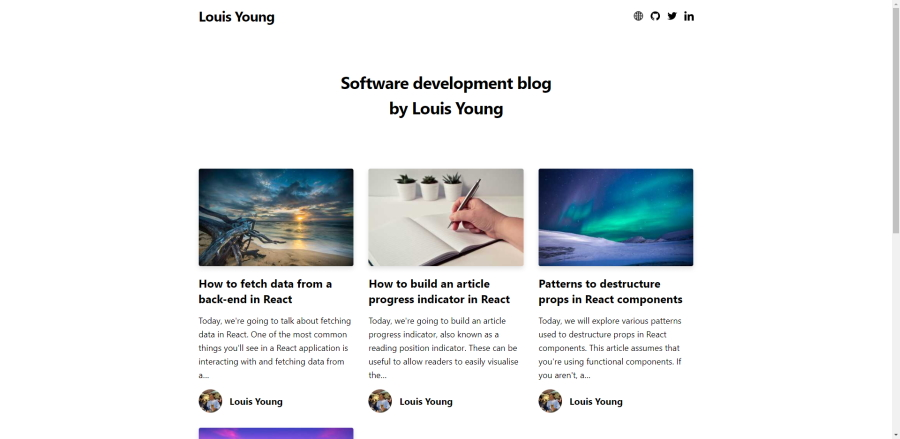

# Personal Blog

A statically generated personal blog website built with Gatsby.

## Description

This is a Gatsby application for my own personal blog. It is statically generated using Gatsby and uses posts written in markdown (MDX).

## Motivation

I built this application to allow myself to create and manage blog posts effortlessly, without having to deal with static HTML or integrating a content management system solely to manage blog posts.

## Technologies

- Gatsby
- React
- Prism
- Tailwind
