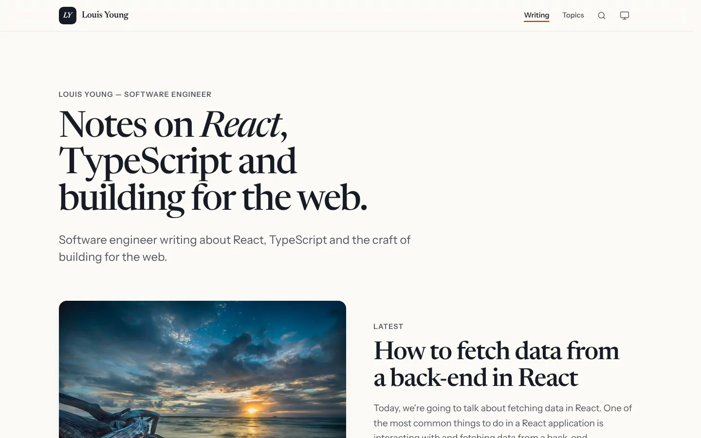
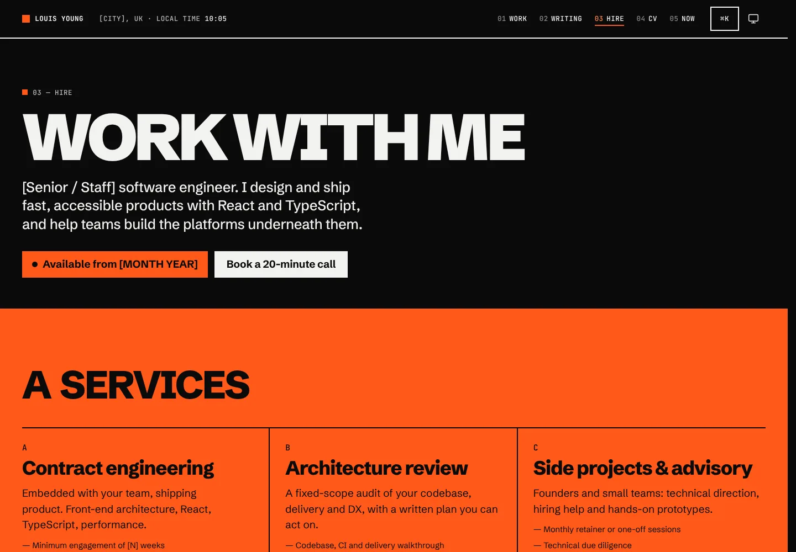

# louisyoung.co.uk

[](https://github.com/louis-young/louisyoung.co.uk/actions/workflows/ci.yml)
[](https://github.com/louis-young/louisyoung.co.uk/actions/workflows/codeql.yml)
[](https://scorecard.dev/viewer/?uri=github.com/louis-young/louisyoung.co.uk)

The personal website of Louis Young, software engineer: selected work, contract and advisory services, a digital CV, and practical, example-led writing about React, TypeScript and the web.

<p>
  
  
</p>

## Highlights

- **Static and fast.** Astro renders every page to HTML at build time. Article pages ship about 4 kB of JavaScript (gzipped), and a test enforces a budget; React only loads for an article's live demo, and only when it scrolls into view.
- **Index design system.** A Swiss grid, huge Schibsted Grotesk capitals, JetBrains Mono labels, hard black rules and one signal orange. OKLCH tokens, a fluid type scale up to an enormous display size, light, dark and system themes with no flash on load, and a 12-column grid overlay on <kbd>G</kbd>.
- **More than a blog.** Case studies (`/work/`), services, rates, process and an enquiry form (`/hire/`), a digital CV with print styles and a generated PDF (`/cv/`, `/cv.pdf`), `/now/`, `/uses/`, a live local clock and public GitHub repositories fetched at build time.
- **⌘K everywhere.** A command palette (<kbd>⌘K</kbd>, <kbd>Ctrl K</kbd>, <kbd>?</kbd>) jumps to any page, case study or article, copies the email address, downloads the CV, switches theme and falls back to full-text search.
- **Content in typed files.** Profile, CV and services live in `content/data/*.ts` and are checked by TypeScript. `pnpm content:todo` lists every `[PLACEHOLDER]` still to fill in.
- **Accessible.** WCAG 2.2 AA is enforced by axe on every page in both themes, plus keyboard, focus and reduced-motion tests.
- **Secure by default.** A hash-based Content Security Policy with no inline-script allowances, strict security headers, and click-to-load third-party embeds.
- **Tested at every layer.** Unit, integration, type, content, end-to-end (Chromium, Firefox, WebKit and mobile), accessibility, visual regression, Lighthouse budgets and scheduled synthetic checks against production.
- **Pleasant to write for.** `pnpm new "Title"` scaffolds a draft. Tables of contents, reading time, Open Graph images, feeds and structured data are generated.

## Getting started

Requires Node 24 (see `.nvmrc`) and pnpm via Corepack.

```sh
corepack enable
pnpm install
pnpm dev
```

## Scripts

| Script                 | What it does                                                                         |
| ---------------------- | ------------------------------------------------------------------------------------ |
| `pnpm dev`             | Start the dev server with drafts visible.                                            |
| `pnpm build`           | Build to `dist/` and generate the Pagefind search index.                             |
| `pnpm preview`         | Serve `dist/` locally.                                                               |
| `pnpm new "Title"`     | Scaffold a draft article.                                                            |
| `pnpm content:todo`    | List every `[PLACEHOLDER]` left in the content (`--strict` fails if any remain).     |
| `pnpm check`           | Format, lint, type-check, file-name lint, spell-check and dead-code check.           |
| `pnpm fix`             | Apply Prettier and ESLint fixes.                                                     |
| `pnpm test`            | Unit, integration, content and type tests (Vitest).                                  |
| `pnpm test:coverage`   | The same, with coverage thresholds.                                                  |
| `pnpm test:e2e`        | End-to-end tests in Chromium, Firefox, WebKit and a mobile viewport (needs a build). |
| `pnpm test:a11y`       | axe WCAG 2.2 AA scans and keyboard checks (needs a build).                           |
| `pnpm test:visual`     | Screenshot comparisons; run in CI's Playwright container (needs a build).            |
| `pnpm test:lighthouse` | Lighthouse CI with performance, accessibility, best-practice and SEO budgets.        |
| `pnpm test:html`       | Validate the built HTML.                                                             |
| `pnpm test:synthetic`  | Smoke tests against production (`SYNTHETIC_BASE_URL` overrides the target).          |

## Documentation

- [Editing your profile, CV, services and case studies](docs/content.md)
- [Writing an article](docs/authoring.md)
- [Architecture](docs/architecture.md)
- [Architecture decision records](docs/adr/)
- [Contributing](CONTRIBUTING.md)
- [Security policy](SECURITY.md)

## Licence

The code is [MIT licensed](LICENSE). The articles and images are not covered by that licence.
